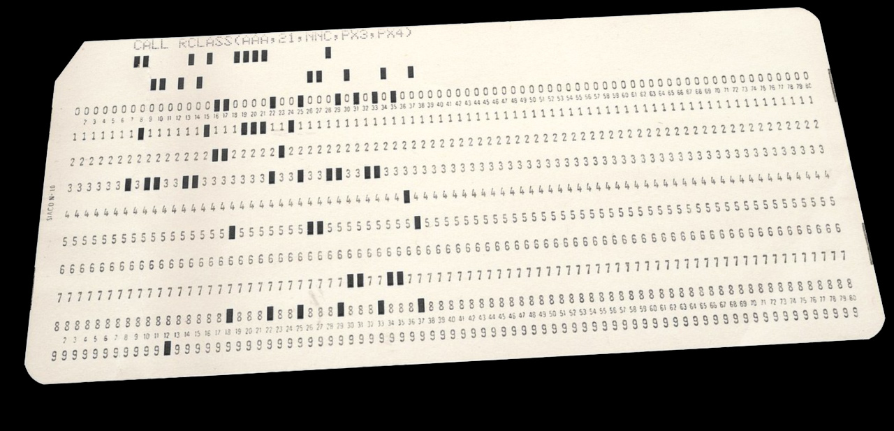

Proof of concept reading of punched cards using photos of punched cards
and OpenCV. If one has a stack of punched card, the idea is to take photos
of each card (without having to be *too* careful about orientation and
perspective) and use this program to read them.

Currently only works with one specific type of card:

...and fails when photos have (too much) perspective:

### Run code
    > python3 readcard.py test-cards/card.jpg
          CALL RCLASS(AAA,21,NNC,PX3,PX4)
    > python3 readcard.py test-cards/card-rotated.jpg
          CALL RCLASS(AAA,21,NNC,PX3,PX4)
    > python3 readcard.py test-cards/card-perspective.jpg
          &ALL RCLASS(AAA,21,NNCYPX YPX )  -- fails!

### Basic outline of how it works

1. Find upper left corner (the diagonally cut corner) by checking
   which corner that has most background pixels.

2. Now that we know the orientation of the card, use a grid approach
   to go through each potentially punched position to see if it is
   punched or not, again by counting background pixels. Each column
   forms a bit pattern.

   (This is where handling perspective gets tricky and the current
   solution is not accurate enough.)

3. Match this bit pattern with a fixed 64 character map (different
   punched cards can have different maps).
